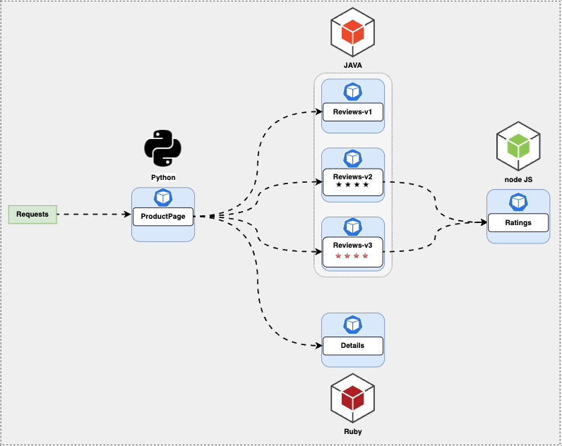
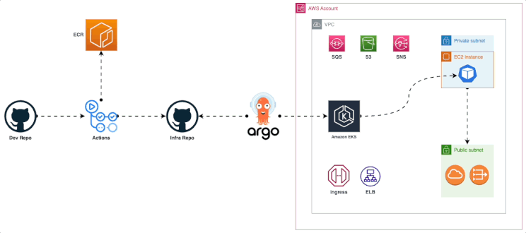
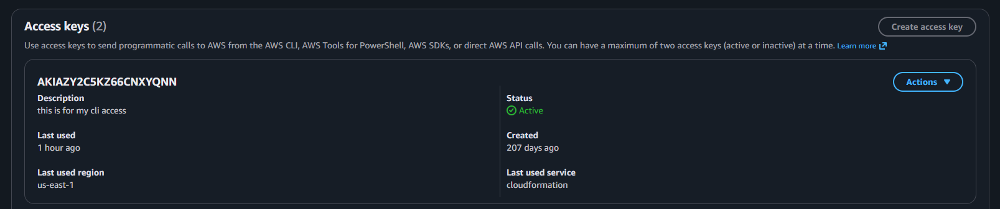
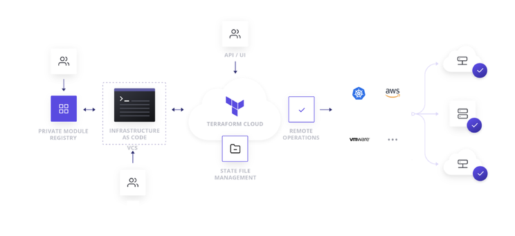
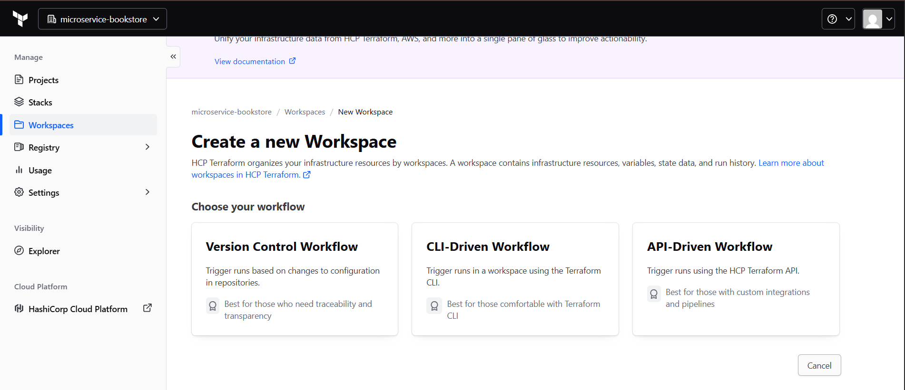
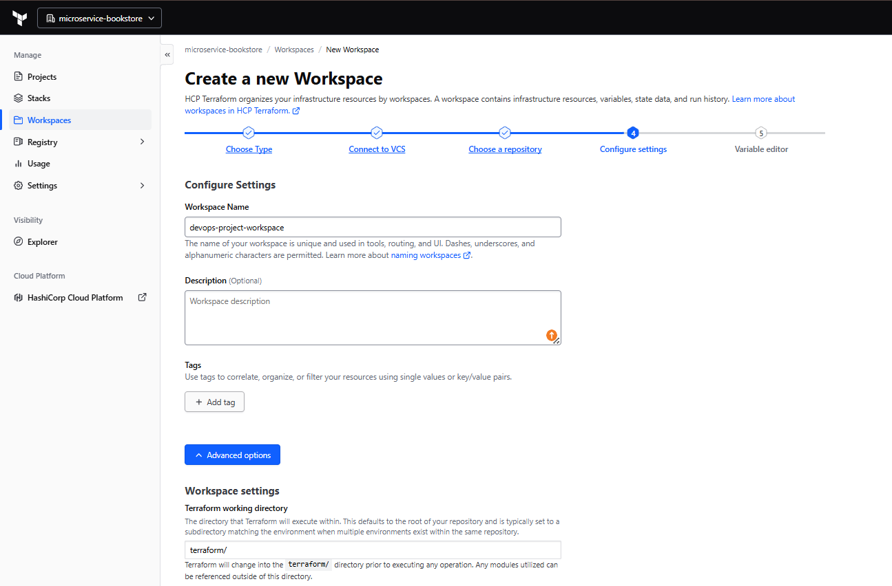

# Microservices BookStore - CloudSpace DevOps Accelerator Program (DAP)

Building a BookStore leveraging MicroServices.
Step by Step BookStore DevOps Project.

## Project Overview

I am focusing on constructing an AWS environment, setting up a Kubernetes cluster through Amazon Elastic Kubernetes Service (EKS), and implementing an efficient process for continuous integration and deployment.

To lay the groundwork, I am utilizing the Bookinfo demonstration application. This application, consisting of multiple services, serves as an illustration of the intricacies inherent in a contemporary Microservices architecture.

### Key Technologies I'm Using:

- **GitHub Actions**: CI/CD platform integrated with GitHub for automating workflows.
- **AWS**: Cloud services provider for hosting applications and managing infrastructure.
- **EKS**: Amazon Elastic Kubernetes Service for deploying, managing, and scaling containerized applications.
- **ArgoCD**: Declarative GitOps continuous delivery tool for Kubernetes.
- **Terraform**: Infrastructure as Code (IaC) tool for provisioning and managing AWS resources.
- **ECR**: Amazon Elastic Container Registry for securely storing and managing Docker images.
- **Grafana**: Monitoring and visualization platform for metrics.
- **Prometheus**: Open-source monitoring and alerting toolkit.

I am trying to cover more Technologies and concepts in this project as possible.

## Problem Statement

In today's rapidly evolving tech landscape, I am mastering DevOps tools and technologies to streamline workflows, foster collaboration, and expedite project delivery. I have dedicated significant time and effort to completing courses on essential tools such as Terraform, ArgoCD, Istio, Kubernetes, and AWS, equipping myself with the theoretical knowledge needed to revolutionize my development processes.

However, what often remains unaddressed is the significant challenge that arises once the courses are completed and the real-world integration journey begins. The struggle of connecting the dots between these powerful tools and effectively implementing them into a cohesive DevOps pipeline can be both daunting and perplexing.

This is a narrative that I have encountered firsthand – the initial excitement of acquiring new skills, followed by the frustration of translating those skills into tangible results within my projects. This workshop aims to address this gap by offering a comprehensive guide not only on the 'how' of using these tools but also on the 'how' within the context of a holistic DevOps approach.

## Technology Stack

- **Application Integration**: Simple Notification Service (SNS)
- **Management & Governance**: CloudWatch
- **Security, Identity & Compliance**: Secret Manager, SonarCloud (SonarQube)
- **CI/CD**: Automate deployment using AWS Code Pipeline, AWS CodeBuild, AWS CodeCommit, AWS CodeArtifact

## Architecture Diagram

Microservices Architecture:



Technology Stack Diagram:


## Getting Started

### Prerequisites

Before I get started, I make sure I have the following prerequisites in place:

- AWS account
- AWS CLI
- Docker
- Git for cloning the repository
- Any modern code editor (e.g., Visual Studio Code, Sublime Text, etc.)

To begin, I need an AWS account. If I don't have one, I head to the AWS website and sign up for an account.

I need IAM user Access Key and Secret Key to be used with Terraform.


**Important**: I never disclose my Access Keys to anyone, and I consistently utilize Secrets Managers.

## Table of Contents

- Step-1: Clone the repository
- Step-2: Terraform Workflow
- Step-3: Terraform Cloud Env Vars
- Step-4: Install Required CLIs
- Step-5: Update Workflows with ECR URL
- Step-6: Update GitHub Repo with AWS Secrets
- Step-7: Deploy the Microservices Manifests
- Step-8: Istio Proxy uses Envoy
- Step-9: Test my BookStore Application
- Step-10: Monitoring

## Step-1: Clone the Repository

Please clone the project repository to your local machine:

```bash
git clone https://github.com/Fokoue22/microservice-bookstore.git
```

## Step-2: Terraform Workflow

In this workshop, we are using Terraform Cloud to let Terraform runs in a consistent and reliable environment.



### Setting up Terraform Cloud

- First, create an account on Terraform Cloud if you don’t have one.

[Terraform Cloud Sign up](https://app.terraform.io/signup) (Terraform Cloud has a Free License so I don't need to worry about pricing)

- I create my first organization and then set up a workspace in Terraform Cloud. This will help me manage my infrastructure as code and enable collaboration.



### Choosing a Workflow

- I choose **Version Control Workflow** to work with my repository on Github.

- **Version Control Workflow** > Connect to Github > choose the repository > configure Setting



- In Advanced options, I configure the Terraform Working Directory as `terraform` since my Terraform code is inside the terraform directory.

Before talking about the Terraform files, I take time to read about [Terraform — Best Practices](https://www.terraform.io/docs/cloud/guides/recommended-practices/index.html).

I learn and pick the right Terraform code structure I need to follow.

### Terraform Directory Structure

#### terraform.tf

This Terraform configuration block includes settings for Terraform Cloud and configures the AWS provider. Let me break down the code step by step:

**1. Terraform Cloud Configuration:**

```hcl
terraform {
  cloud {
    organization = "devops-project-org"

    workspaces {
      name = "devops-project-workspace"
    }
  }
}
```

In this part of the code, I am configuring Terraform Cloud settings:
- **organization**: The name of my Terraform Cloud organization is set to "devops-project-org".
- **workspaces**: Within the organization, a workspace is configured with the name "devops-project-workspace". A workspace in Terraform Cloud is an isolated environment for managing infrastructure.

**2. AWS Provider Configuration:**

```hcl
provider "aws" {
  region = "us-east-1"
}
```

This part of the code configures the AWS provider:
- **aws**: The name of the provider is "aws", indicating that this block configures resources from Amazon Web Services (AWS).
- **region**: The AWS region is set to "us-east-1", which means resources I create using this provider will be located in the US East (North Virginia) region.

#### vpc.tf

This Terraform code snippet is used to create a Virtual Private Cloud (VPC) in Amazon Web Services (AWS) using the terraform-aws-modules/vpc/aws module. Let me break down the code step by step:

**1. Module Declaration:**

```hcl
module "vpc" {
  source = "terraform-aws-modules/vpc/aws"
}
```

Here, I am declaring a Terraform module named "vpc" using the module source terraform-aws-modules/vpc/aws. This module is available in the Terraform registry and is designed to create a VPC with AWS resources.

**2. Module Parameters:**

```hcl
name = "my-vpc"
cidr = "10.0.0.0/16"
```

These parameters define the basic configuration of the VPC:
- **name**: The name of my VPC will be set to "my-vpc".
- **cidr**: The IP range for my VPC is set to "10.0.0.0/16".

**3. Availability Zones and Subnets:**

```hcl
azs             = ["us-east-1a", "us-east-1b", "us-east-1c"]
private_subnets = ["10.0.1.0/24", "10.0.2.0/24", "10.0.3.0/24"]
public_subnets  = ["10.0.101.0/24", "10.0.102.0/24", "10.0.103.0/24"]
```

These parameters specify the availability zones and subnets for my VPC:
- **azs**: The list of Availability Zones where the subnets will be created.
- **private_subnets**: The list of private subnet CIDR blocks.
- **public_subnets**: The list of public subnet CIDR blocks.

**4. NAT and VPN Gateways:**

```hcl
enable_nat_gateway = true
enable_vpn_gateway = true
```

These settings enable NAT and VPN gateways for my VPC:
- **enable_nat_gateway**: NAT gateways will be created for the private subnets.
- **enable_vpn_gateway**: A VPN gateway will be created for my VPC.

**5. Tags:**

```hcl
tags = {
  Terraform   = "true"
  Environment = "dev"
}
```

This block assigns tags to the resources I create. Tags are metadata that provide additional information about resources. Here, I add two tags: "Terraform" with the value "true" and "Environment" with the value "dev".

#### ecr.tf

This Terraform code snippet creates an Amazon Elastic Container Registry (ECR) repository and defines an output to display the repository URL. Let me break down the code step by step:

**1. ECR Repository Resource:**

```hcl
resource "aws_ecr_repository" "my_repo" {
  name                    = "my-ecr-repo"
  image_tag_mutability    = "MUTABLE"
}
```

In this part of the code, I am creating an AWS ECR repository named "my-ecr-repo" using the aws_ecr_repository resource. The parameters I've set are:
- **name**: The name of my ECR repository is set to "my-ecr-repo".
- **image_tag_mutability**: The mutability of image tags is set to "MUTABLE", which means I can overwrite tags on images.

**2. Output for Repository URL:**

```hcl
output "repository_url" {
  value = aws_ecr_repository.my_repo.repository_url
}
```

This part of the code defines an output named "repository_url" that will display the URL of my ECR repository. The value of this output is set to the repository URL of the aws_ecr_repository.my_repo resource.

#### eks.tf

This Terraform code is used to create an Amazon Elastic Kubernetes Service (EKS) cluster using the terraform-aws-modules/eks/aws module. Let me break down the code step by step:

**1. Module Declaration:**

```hcl
module "eks" {
  source  = "terraform-aws-modules/eks/aws"
  version = "~> 19.0"
}
```

This declares a Terraform module named "eks" and specifies the source from which to fetch the EKS module (terraform-aws-modules/eks/aws) along with a version constraint.

**2. Cluster Configuration:**

```hcl
cluster_name    = "my-cluster"
cluster_version = "1.27"
cluster_endpoint_public_access  = true
```

These parameters configure my EKS cluster:
- **cluster_name**: The name of my EKS cluster will be set to "my-cluster".
- **cluster_version**: The Kubernetes version of my cluster will be "1.27".
- **cluster_endpoint_public_access**: The Kubernetes API server endpoint will have public access.

**3. Cluster Addons:**

```hcl
cluster_addons = {
  coredns = { most_recent = true }
  kube-proxy = { most_recent = true }
  vpc-cni = { most_recent = true }
}
```

This block configures cluster addons like CoreDNS, kube-proxy, and vpc-cni to use the most recent versions.

**4. VPC and Subnet Configuration:**

```hcl
vpc_id                   = module.vpc.vpc_id
subnet_ids               = module.vpc.private_subnets
control_plane_subnet_ids = module.vpc.public_subnets
```

These parameters specify the Virtual Private Cloud (VPC) and subnet details for my EKS cluster using outputs from another module (likely named "vpc").

**5. Managed Node Group Configuration:**

```hcl
eks_managed_node_group_defaults = {
  instance_types = ["m6i.large", "m5.large", "m5n.large", "t3.large"]
}

eks_managed_node_groups = {
  green = {
    use_custom_launch_template = false
    min_size     = 1
    max_size     = 10
    desired_size = 1
    instance_types = ["t3.large"]
    capacity_type  = "SPOT"
  }
}
```

This section configures an EKS managed node group named "green" with specific instance types, sizes, and capacity type (SPOT).

**6. Fargate Profiles:**

```hcl
fargate_profiles = {
  default = {
    name = "default"
    selectors = [ { namespace = "default" } ]
  }
}
```

This section defines a Fargate profile named "default" that targets the "default" namespace.

**7. Tags:**

```hcl
tags = {
  Environment = "dev"
  Terraform   = "true"
}
```

Tags are assigned to the created resources for organization and identification purposes.

## Step-3: Terraform Cloud Env Vars

I need to configure my organization with my Access Key and Secret Key. I can do it specific for the workspace or globally for the organization.

I do it globally now for the organization by creating a Variable Set:
- Under the organization setting, I go to Variable sets and Create a new one with the name `AWS_Credentials`
- under *Variable set scope* i selected `Apply to all project and workspaces`

### Plan and Apply Terraform Code

Now I am ready to start the Plan:

1. Review the Plan resources
2. Confirm & Apply

### Check AWS Resources Creation

I verify in the AWS Management Console that my defined resources have been created as intended.

### Deploy EKS-Manage EC2 Instance

Of course it doesn't have to be an EC2 instance, I can use my Terminal.

I set up this instance to manage my EKS cluster from.

**Deploy ubuntu instance**

I install tools like kubectl (Kubernetes command-line tool), aws-cli (AWS Command Line Interface), and any other utilities I might need.

**Install aws-cli**

```bash
sudo apt install unzip
curl "https://awscli.amazonaws.com/awscli-exe-linux-x86_64.zip" -o "awscliv2.zip"
unzip awscliv2.zip
sudo ./aws/install
aws --version
```

**Install kubectl**

```bash
curl -LO "https://dl.k8s.io/release/$(curl -L -s https://dl.k8s.io/release/stable.txt)/bin/linux/amd64/kubectl"
curl -LO "https://dl.k8s.io/$(curl -L -s https://dl.k8s.io/release/stable.txt)/bin/linux/amd64/kubectl.sha256"
echo "$(cat kubectl.sha256) kubectl" | sha256sum --check
sudo install -o root -g root -m 0755 kubectl /usr/local/bin/kubectl
kubectl version --client
```

**Configure AWS Credentials**

I run `aws configure` and provide my AWS Access Key ID, Secret Access Key, default region, and output format.

**Configure kubectl**

```bash
aws eks update-kubeconfig --name my-cluster --region us-east-1
```

**Test kubectl by running**

```bash
kubectl get nodes
```

If I get a "connection refused" error, I need to troubleshoot why my kubectl client can't talk with the EKS endpoint.

**Hint**: Something is blocking the requests to the EKS endpoint.

Now after I can talk to my EKS, I should add this fix to my Terraform code.

Now I can run:

```bash
kubectl get nodes

##OUTPUT##

NAME                         STATUS   ROLES    AGE   VERSION
ip-10-0-1-149.ec2.internal   Ready    <none>   64s   v1.27.3-eks-a5565ad
```

## Step-4: Install Required CLIs

I have installed the AWS CLI and kubectl. Now I need to install istioctl and argo CLI and install the required k8s resources.

### istioctl

```bash
curl -L https://istio.io/downloadIstio | sh -
cd istio-1.18.2/
export PATH=$PWD/bin:$PATH
istioctl install --set profile=demo -y
```

**istioctl** is a command-line utility provided by Istio for installing and interacting with Istio deployments.
- **install** is the subcommand I use to install Istio components.
- **-set profile=demo** specifies the installation profile. The "demo" profile includes a set of Istio components suitable for demonstration purposes.

### argo CLI

```bash
curl -sSL -o argocd-linux-amd64 https://github.com/argoproj/argo-cd/releases/latest/download/argocd-linux-amd64
sudo install -m 555 argocd-linux-amd64 /usr/local/bin/argocd
rm argocd-linux-amd64
```

### Argo CD install

```bash
kubectl create namespace argocd
kubectl apply -n argocd -f https://raw.githubusercontent.com/argoproj/argo-cd/stable/manifests/install.yaml
kubectl patch svc argocd-server -n argocd -p '{"spec": {"type": "LoadBalancer"}}'
```

This command patches (updates) the Argo CD server service to change its service type to a LoadBalancer. This modification makes the Argo CD server accessible from outside my Kubernetes cluster via a load balancer's public IP address or DNS.

### Argo CD Initial Admin Secret

```bash
argocd admin initial-password -n argocd
```

It's not a best practice to do it from the Terminal but I will give you a hint "Terraform".

## 🔧 Step-5: Update Workflows with ECR URL

I modify my continuous integration workflows to include the ECR repository URL for Container image storage.

Under `.github/workflows/` I find the Github Actions I will use to build/push my container images. Let me break one workflow down.

### details_workflow.yml

**Workflow Name and Trigger:**
- **name**: Describes the name of the workflow.
- **on**: Specifies the events that trigger the workflow.
  - **workflow_dispatch**: Allows manual triggering of the workflow.
  - **push**: Triggers the workflow when code changes are pushed to the repository's specified paths.

**Environment Variables:**
- **env**: Defines environment variables that will be available to the workflow steps.
  - **ECR_REGISTRY**: Specifies the Amazon ECR (Elastic Container Registry) registry URL.
  - **ECR_REPOSITORY**: Specifies the ECR repository name.

**Jobs:**
- **jobs**: Contains one or more jobs to be executed in sequence.
  - **build_and_push_image**: Describes a job named "build_and_push_image" that runs on an Ubuntu environment.
  - **runs-on**: Specifies the type of runner environment.
  - **steps**: Lists the individual steps within the job.

**Steps:**
A series of steps, each with a specific name, purpose, and associated actions.
- **uses** refers to pre-built GitHub Actions that perform specific tasks.

Here's what each step does:
1. **Checkout code**: Retrieves the repository's code using the actions/checkout GitHub Action.
2. **Configure AWS credentials**: Configures AWS credentials to access the ECR registry.
3. **Login to Amazon ECR**: Uses the aws-actions/amazon-ecr-login GitHub Action to log in to the ECR registry.
4. **Get short SHA**: Retrieves the short SHA hash of the latest Git commit.
5. **Build and push Docker image**: Builds a Docker image and pushes it to the specified ECR repository.
6. **Update Kubernetes Deployment Image**: Updates the image tag in a Kubernetes deployment YAML file to match the built Docker image.
7. **Commit and Push Changes**: Commits the changes made to the Kubernetes deployment YAML file and pushes them to the repository.

## Step-6: Update GitHub Repo with AWS Secrets

Under **Setting > Secrets and Variables > Actions**, I add my AWS secrets.

### Run Workflows

Let's the party begins!

As I am using one repository, I need my Github Workflow to update the new image.

I should configure the Actions to be able to Read and Write to my repository:
- Under **Setting > Actions > General**

The Workflows will run if there is a push inside the services directories or manually. I will run them Manually Now.

I will find that I only added the Update Kubernetes Deployment Image part to details_workflow.yml.

I need to complete the other Workflows.

I need to check the manifests/kubernetes image part to match it with the Workflows.

### Check ECR Repo

I verify that my Docker images are being pushed to the ECR repository.

## Step-7: Deploy the Microservices Manifests

Under `argocd/apps/services`, I find the Application CRD for argocd app to deploy my manifest resources to Kubernetes.

### Argo CD Configuration

On the argocd homepage, I create a NEW APP with the following configuration:

- **Application Name**: app-services
- **Project Name**: default
- **Sync Policy**: Automatic
- **[x] PRUNE RESOURCES**
- **[x] SELF HEAL**
- **[x] AUTO-CREATE NAMESPACE**
- **Repository URL**: [My Repository URL]
- **Path**: argocd/apps/services/
- **Cluster URL**: [My Cluster URL]
- **Namespace**: staging

I can check the Argo CD home page and also check the resources in the EKS on AWS Console.

If I check any POD in staging Namespace, I will find that each one has two Containers.

## Step-8: Istio Proxy uses Envoy

Envoy proxies are deployed as sidecars to services, logically augmenting the services with Envoy's many built-in features, for example:

- Dynamic service discovery
- Load balancing
- TLS termination
- HTTP/2 and gRPC proxies
- Circuit breakers
- Health checks
- Staged rollouts with %-based traffic split
- Fault injection
- Rich metrics

### Istio Gateways and VirtualServices

**Istio Gateway**: An Istio Gateway is a configuration resource that describes how external traffic (e.g., traffic from outside the Kubernetes cluster) is brought into the service mesh and how it's routed to services. It acts as an entry point into the mesh for incoming traffic. Gateways can be used to manage different protocols, such as HTTP, HTTPS, or TCP, and they can handle traffic based on hostnames, paths, and ports.

- **Hosts and Ports**: A Gateway is configured with a set of hosts and ports that it listens on. These could be domain names (for HTTP/HTTPS) or IP addresses and port numbers (for TCP).
- **TLS Termination**: Gateways can perform TLS termination, meaning they can handle SSL/TLS encryption and decryption for incoming traffic.
- **Virtual Services**: Gateways are often associated with VirtualServices to define how incoming traffic should be forwarded to specific services.

**Istio VirtualService**: A VirtualService is a configuration resource that defines how traffic should be routed within the service mesh. It allows me to control the routing of traffic based on criteria like URI paths, headers, and more. VirtualServices are associated with one or more Istio Services and are often used in conjunction with Gateways to control how external traffic is routed to services.

- **Destination Rules**: VirtualServices can refer to DestinationRules, which define how traffic should be load-balanced between different versions of a service (canary deployments, blue-green deployments, etc.).
- **Traffic Splitting**: VirtualServices can split traffic between different versions of services based on weights or other criteria.
- **Match Conditions**: VirtualServices define match conditions that determine which traffic is affected by the rules defined within them.
- **Fault Injection**: VirtualServices can also be used to inject faults or delays into requests for testing purposes.

### Deploy Gateways and VirtualServices

Under `manifests/networking/gateways`, I create an Argo CD app to deploy them.

## Step-9: Test my BookStore Application

From the previous step, I can browse to the istio-ingressgateway url/productpage.

To get the url:

```bash
kubectl get services -n istio-system

NAME                   TYPE           CLUSTER-IP       EXTERNAL-IP                                                               PORT(S)                                                                      AGE
istio-ingressgateway   LoadBalancer   172.20.27.197    ae271cd157c214ab888061809021225a-1922516608.us-east-1.elb.amazonaws.com   15021:32042/TCP,80:30092/TCP,443:31659/TCP,31400:31529/TCP,15443:32377/TCP   148m
```

It will be the elb/dns under External-IP. I will open the application on my browser using that same link.

## Step-10: Monitoring

Under `argocd/apps/observability`, I create a NEW APP in the monitoring Namespace.

I have Prometheus (Metrics Datastore), Loki (Logging), Jaeger (Tracing). In short:

- **Logging**: Recording events and activities for troubleshooting.
- **Metrics**: Measuring performance with numbers and graphs.
- **Tracing**: Following data flow to find performance issues.

### Grafana

One of many dashboards I can import and a lot to explore.

### Kiali

A comprehensive monitoring tool for Istio Service Mesh and also there is a lot to explore.

The dashboard can give me a Live fast response to any issue that could happen to any of my Microservices.

## 
License

This project is licensed under the MIT License.

## Author
FOKOUE THOMAS